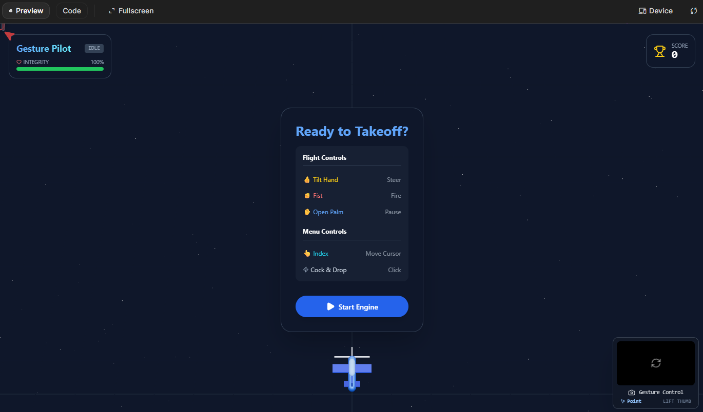
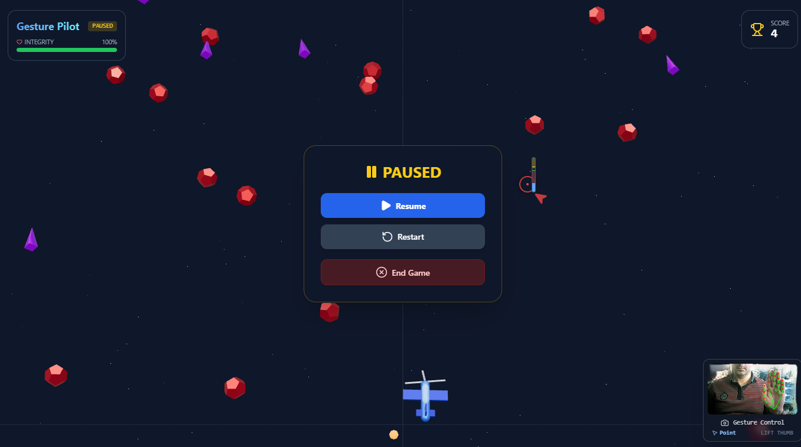
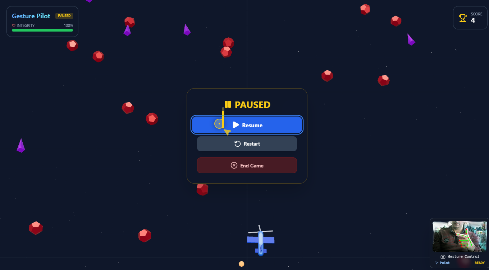

Gesture Pilot 3D game was developed by Gemini 3 Pro, via aistudio.google.com.
All implementation has been done with prompts.

The menu buttons are clicked with a gun gesture. The thumb finger should be opened then closed. Sign figner is used as cursor.

In the game, to move the plane, the hand gesture should be fist. When the fist is moved to the left or to the right, the plane is moved accordingly. If thumb is opened, firing is cancelled, so, to fire, the thumb finger should be closed and even it should be hidden in the palm.

While playing, to open pause menu, stop hand gesture (the opened palm gesture) should be shown.

All corresponding gestures are also shown in the game menu displays.

There are red obstacles and cone shaped enemies. Some enemies can fire. After hitting obstacles and enemies, health bonus is dropped into the game scene randomly.

This is a just simple demo game that is fully played via hand gestures and all design details, implementations were done by Gemini.

To handle hand gestures, the mediapipe/tasks-vision library was used by Gemini.

Gemini also used react-zustand to handle game states.

As it can be seen, to create 3D js objects and interactions, three.js is being used. To make react app more optimized for 3D interactions, React Three Fiber (R3F) library is also used. Three.js simplifies the create 3D js implementation and at the background it uses WebGL.
